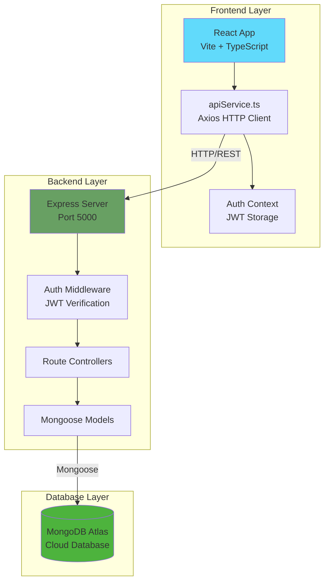
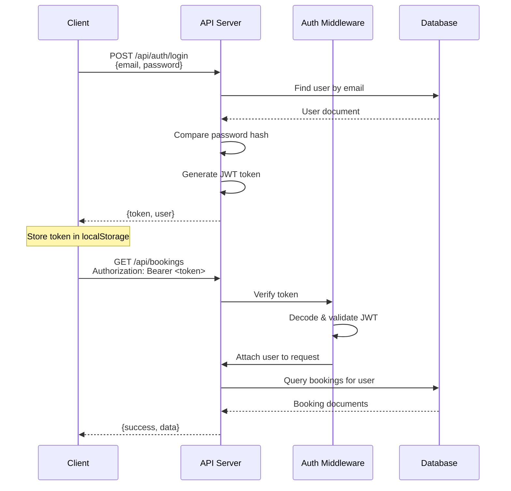
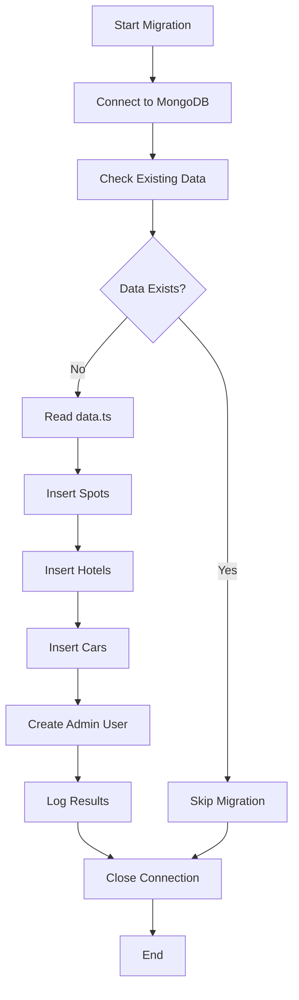
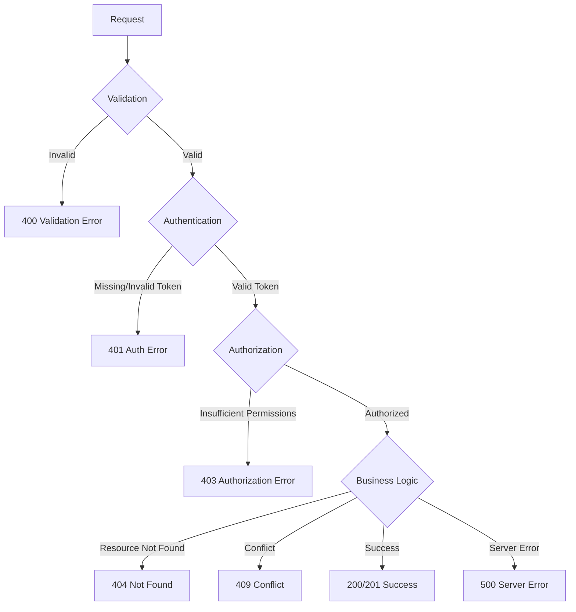

# Design Document: MongoDB Database Integration

## Overview

This design document specifies the technical architecture for integrating MongoDB Atlas into the Trip Wise Pakistan application. The integration replaces the current localStorage-based mock implementation with a production-ready backend API, enabling persistent data storage, user authentication, and scalable multi-user functionality.

### System Architecture

The system follows a three-tier architecture:

1. **Frontend Layer**: React 19.2 + TypeScript SPA with Vite, communicating via HTTP
2. **Backend Layer**: Node.js + Express REST API with TypeScript, handling business logic and authentication
3. **Database Layer**: MongoDB Atlas cloud database with Mongoose ODM

### Key Design Decisions

**Why Node.js/Express**: Matches the TypeScript ecosystem of the frontend, enabling code sharing and consistent development experience. Express provides mature middleware ecosystem for authentication, validation, and security.

**Why Mongoose**: Provides schema validation, middleware hooks, and type-safe queries. Simplifies MongoDB operations with an intuitive API while maintaining flexibility for complex queries.

**Why JWT Authentication**: Stateless authentication suitable for mobile apps and SPAs. Tokens can be stored client-side and validated without database lookups on every request.

**Why REST over GraphQL**: Simpler implementation for CRUD operations, better caching with HTTP methods, and easier integration with existing frontend patterns.


## Architecture

### High-Level Architecture Diagram



### Backend Folder Structure

```
backend/
├── src/
│   ├── config/
│   │   └── database.ts          # MongoDB connection configuration
│   ├── models/
│   │   ├── User.ts              # User schema and model
│   │   ├── Spot.ts              # Spot schema and model
│   │   ├── Hotel.ts             # Hotel schema and model
│   │   ├── Car.ts               # Car schema and model
│   │   ├── Post.ts              # Post schema and model
│   │   ├── Booking.ts           # Booking schema and model
│   │   ├── PriceAlert.ts        # PriceAlert schema and model
│   │   └── Review.ts            # Review schema and model (NEW)
│   ├── middleware/
│   │   ├── auth.ts              # JWT authentication middleware
│   │   ├── admin.ts             # Admin authorization middleware
│   │   ├── errorHandler.ts     # Global error handling
│   │   └── validation.ts        # Input validation middleware
│   ├── routes/
│   │   ├── auth.routes.ts       # Authentication endpoints
│   │   ├── spot.routes.ts       # Spot CRUD endpoints
│   │   ├── hotel.routes.ts      # Hotel CRUD endpoints
│   │   ├── car.routes.ts        # Car CRUD endpoints
│   │   ├── post.routes.ts       # Post CRUD endpoints
│   │   ├── booking.routes.ts    # Booking CRUD endpoints
│   │   ├── priceAlert.routes.ts # Price alert endpoints
│   │   ├── review.routes.ts     # Review endpoints (NEW)
│   │   ├── user.routes.ts       # User profile endpoints
│   │   └── ai.routes.ts         # AI recommendation endpoints
│   ├── controllers/
│   │   ├── auth.controller.ts
│   │   ├── spot.controller.ts
│   │   ├── hotel.controller.ts
│   │   ├── car.controller.ts
│   │   ├── post.controller.ts
│   │   ├── booking.controller.ts
│   │   ├── priceAlert.controller.ts
│   │   ├── review.controller.ts  # (NEW)
│   │   ├── user.controller.ts
│   │   └── ai.controller.ts
│   ├── utils/
│   │   ├── jwt.ts               # JWT token utilities
│   │   └── validators.ts        # Custom validation functions
│   ├── types/
│   │   └── express.d.ts         # Express type extensions
│   └── server.ts                # Main application entry point
├── scripts/
│   ├── migrate.ts               # Data migration from localStorage
│   ├── seed.ts                  # Database seeding script
│   └── testConnection.ts        # Connection test utility
├── tests/
│   ├── auth.test.ts
│   ├── spots.test.ts
│   └── ...
├── .env.example
├── .gitignore
├── package.json
├── tsconfig.json
└── README.md
```

### Request Flow

1. **Client Request**: Frontend makes HTTP request with optional JWT token in Authorization header
2. **CORS Check**: Express CORS middleware validates origin
3. **Rate Limiting**: Rate limiter checks request frequency per IP
4. **Body Parsing**: Express JSON middleware parses request body
5. **Authentication**: Auth middleware verifies JWT token (if required)
6. **Authorization**: Admin middleware checks user role (if required)
7. **Validation**: Input validation middleware checks request data
8. **Controller**: Route controller processes business logic
9. **Model**: Mongoose model interacts with MongoDB
10. **Response**: JSON response sent back to client
11. **Error Handling**: Global error handler catches and formats errors


## Components and Interfaces

### Backend Components

#### 1. Database Connection (config/database.ts)

**Purpose**: Establish and manage MongoDB Atlas connection

**Interface**:
```typescript
export const connectDatabase = async (): Promise<void>
```

**Configuration**:
- Connection string from `MONGODB_URI` environment variable
- Connection timeout: 10 seconds
- Connection pool: min 5, max 10 connections
- Auto-reconnect enabled
- Retry on connection failure

**Error Handling**:
- Log connection errors with details
- Exit process on initial connection failure
- Emit events for connection state changes

#### 2. Authentication Middleware (middleware/auth.ts)

**Purpose**: Verify JWT tokens and attach user information to requests

**Interface**:
```typescript
export interface AuthRequest extends Request {
  user?: {
    id: string;
    email: string;
    role: 'user' | 'admin';
  };
}

export const authenticate = (
  req: AuthRequest,
  res: Response,
  next: NextFunction
): void
```

**Flow**:
1. Extract token from `Authorization: Bearer <token>` header
2. Verify token using JWT_SECRET
3. Decode payload and attach user info to `req.user`
4. Call `next()` to proceed to route handler
5. Return 401 if token missing, invalid, or expired

#### 3. Admin Authorization Middleware (middleware/admin.ts)

**Purpose**: Restrict endpoints to admin users only

**Interface**:
```typescript
export const requireAdmin = (
  req: AuthRequest,
  res: Response,
  next: NextFunction
): void
```

**Flow**:
1. Check if `req.user.role === 'admin'`
2. Call `next()` if admin
3. Return 403 if not admin

#### 4. Validation Middleware (middleware/validation.ts)

**Purpose**: Validate and sanitize request inputs

**Interface**:
```typescript
export const validate = (validations: ValidationChain[]) => 
  async (req: Request, res: Response, next: NextFunction): Promise<void>
```

**Validation Rules**:
- Email format validation
- String length constraints
- Numeric range validation
- Enum value validation
- ObjectId format validation
- Required field checks
- Input sanitization to prevent injection

#### 5. Error Handler Middleware (middleware/errorHandler.ts)

**Purpose**: Catch and format all errors consistently

**Interface**:
```typescript
export const errorHandler = (
  err: Error,
  req: Request,
  res: Response,
  next: NextFunction
): void
```

**Error Response Format**:
```typescript
{
  success: false,
  message: string,
  errors?: string[],
  statusCode?: number
}
```

**HTTP Status Codes**:
- 400: Validation errors
- 401: Authentication errors
- 403: Authorization errors
- 404: Resource not found
- 429: Rate limit exceeded
- 500: Server errors


### Frontend Components

#### 1. API Service (apiService.ts)

**Purpose**: Centralized HTTP client for all backend communication

**Configuration**:
```typescript
const api = axios.create({
  baseURL: import.meta.env.VITE_API_URL || 'http://localhost:5000',
  timeout: 10000,
  headers: {
    'Content-Type': 'application/json'
  }
});
```

**Request Interceptor**:
```typescript
api.interceptors.request.use((config) => {
  const token = localStorage.getItem('token');
  if (token) {
    config.headers.Authorization = `Bearer ${token}`;
  }
  return config;
});
```

**Response Interceptor**:
```typescript
api.interceptors.response.use(
  (response) => response,
  (error) => {
    if (error.response?.status === 401) {
      localStorage.removeItem('token');
      localStorage.removeItem('user');
      window.location.href = '/auth';
    }
    return Promise.reject(error);
  }
);
```

**Interface Methods**:
```typescript
// Authentication
export const login = (email: string, password: string): Promise<AuthResponse>
export const signup = (name: string, email: string, password: string): Promise<AuthResponse>
export const logout = (): Promise<void>
export const getCurrentUser = (): Promise<User>

// Spots
export const getSpots = (): Promise<Spot[]>
export const getSpot = (id: string): Promise<Spot>
export const searchSpots = (params: SearchParams): Promise<Spot[]>

// Hotels
export const getHotels = (): Promise<Hotel[]>
export const getHotel = (id: string): Promise<Hotel>
export const searchHotels = (params: SearchParams): Promise<Hotel[]>

// Cars
export const getCars = (): Promise<Car[]>
export const getCar = (id: string): Promise<Car>
export const searchCars = (params: SearchParams): Promise<Car[]>

// Posts
export const getPosts = (): Promise<Post[]>
export const createPost = (data: CreatePostData): Promise<Post>
export const likePost = (id: string): Promise<Post>
export const deletePost = (id: string): Promise<void>

// Bookings
export const getBookings = (): Promise<Booking[]>
export const createBooking = (data: BookingData): Promise<Booking>
export const cancelBooking = (id: string): Promise<Booking>

// Price Alerts
export const getPriceAlerts = (): Promise<PriceAlert[]>
export const createPriceAlert = (data: PriceAlertData): Promise<PriceAlert>
export const deletePriceAlert = (id: string): Promise<void>

// Reviews (NEW)
export const getReviews = (itemType: string, itemId: string): Promise<Review[]>
export const createReview = (data: ReviewData): Promise<Review>
export const updateReview = (id: string, data: Partial<ReviewData>): Promise<Review>
export const deleteReview = (id: string): Promise<void>

// AI
export const getAIRecommendations = (request: RecommendationRequest): Promise<Spot[]>
export const chatWithAI = (query: string): Promise<string>
```

#### 2. Auth Context Updates

**Purpose**: Manage authentication state with real API

**Changes**:
- Replace mock login/signup with apiService calls
- Store JWT token in localStorage
- Decode token to get user info
- Handle token expiration
- Clear token on logout


## Data Models

### 1. User Model

**Collection**: `users`

**Mongoose Schema**:
```typescript
import mongoose, { Schema, Document } from 'mongoose';
import bcrypt from 'bcrypt';

export interface IUser extends Document {
  name: string;
  email: string;
  password: string;
  role: 'user' | 'admin';
  avatar?: string;
  createdAt: Date;
  updatedAt: Date;
  comparePassword(candidatePassword: string): Promise<boolean>;
}

const userSchema = new Schema<IUser>({
  name: {
    type: String,
    required: [true, 'Name is required'],
    minlength: [2, 'Name must be at least 2 characters'],
    trim: true
  },
  email: {
    type: String,
    required: [true, 'Email is required'],
    unique: true,
    lowercase: true,
    trim: true,
    match: [/^\S+@\S+\.\S+$/, 'Please provide a valid email']
  },
  password: {
    type: String,
    required: [true, 'Password is required'],
    minlength: [60, 'Password hash must be 60 characters']
  },
  role: {
    type: String,
    enum: ['user', 'admin'],
    default: 'user'
  },
  avatar: {
    type: String
  }
}, {
  timestamps: true
});

// Index for query performance
userSchema.index({ email: 1 });

// Hash password before saving
userSchema.pre('save', async function(next) {
  if (!this.isModified('password')) return next();
  this.password = await bcrypt.hash(this.password, 10);
  next();
});

// Method to compare passwords
userSchema.methods.comparePassword = async function(candidatePassword: string): Promise<boolean> {
  return bcrypt.compare(candidatePassword, this.password);
};

export const User = mongoose.model<IUser>('User', userSchema);
```

**Indexes**:
- `email`: Unique index for login queries

**Security**:
- Password hashed with bcrypt (10 salt rounds)
- Password never returned in queries (use `.select('-password')`)
- Email stored in lowercase for case-insensitive matching


### 2. Spot Model

**Collection**: `spots`

**Mongoose Schema**:
```typescript
import mongoose, { Schema, Document } from 'mongoose';

export interface ISpot extends Document {
  name: string;
  region: 'Northern Areas' | 'Punjab' | 'Sindh' | 'Khyber Pakhtunkhwa' | 'Balochistan' | 'Azad Kashmir' | 'Gilgit-Baltistan';
  description: string;
  imageUrl: string;
  tags: string[];
  rating: number;
  coordinates: {
    lat: number;
    lng: number;
  };
  amenities: string[];
  reviews: number;
}

const spotSchema = new Schema<ISpot>({
  name: {
    type: String,
    required: [true, 'Spot name is required'],
    trim: true
  },
  region: {
    type: String,
    required: [true, 'Region is required'],
    enum: ['Northern Areas', 'Punjab', 'Sindh', 'Khyber Pakhtunkhwa', 'Balochistan', 'Azad Kashmir', 'Gilgit-Baltistan']
  },
  description: {
    type: String,
    required: [true, 'Description is required']
  },
  imageUrl: {
    type: String,
    required: [true, 'Image URL is required'],
    match: [/^https?:\/\/.+/, 'Please provide a valid URL']
  },
  tags: {
    type: [String],
    required: true,
    default: []
  },
  rating: {
    type: Number,
    required: true,
    min: [0, 'Rating must be at least 0'],
    max: [5, 'Rating cannot exceed 5'],
    default: 0
  },
  coordinates: {
    lat: {
      type: Number,
      required: [true, 'Latitude is required'],
      min: [-90, 'Latitude must be between -90 and 90'],
      max: [90, 'Latitude must be between -90 and 90']
    },
    lng: {
      type: Number,
      required: [true, 'Longitude is required'],
      min: [-180, 'Longitude must be between -180 and 180'],
      max: [180, 'Longitude must be between -180 and 180']
    }
  },
  amenities: {
    type: [String],
    required: true,
    default: []
  },
  reviews: {
    type: Number,
    required: true,
    min: [0, 'Reviews count cannot be negative'],
    default: 0
  }
}, {
  timestamps: true
});

// Indexes for query performance
spotSchema.index({ region: 1 });
spotSchema.index({ tags: 1 });
spotSchema.index({ coordinates: '2dsphere' }); // Geospatial index
spotSchema.index({ name: 'text', description: 'text' }); // Text search

export const Spot = mongoose.model<ISpot>('Spot', spotSchema);
```

**Indexes**:
- `region`: For filtering by region
- `tags`: For tag-based searches
- `coordinates`: 2dsphere index for location-based queries
- `name, description`: Text index for full-text search


### 3. Hotel Model

**Collection**: `hotels`

**Mongoose Schema**:
```typescript
import mongoose, { Schema, Document } from 'mongoose';

export interface IHotel extends Document {
  name: string;
  location: string;
  pricePerNight: number;
  rating: number;
  imageUrl: string;
  amenities: string[];
}

const hotelSchema = new Schema<IHotel>({
  name: {
    type: String,
    required: [true, 'Hotel name is required'],
    trim: true
  },
  location: {
    type: String,
    required: [true, 'Location is required'],
    trim: true
  },
  pricePerNight: {
    type: Number,
    required: [true, 'Price per night is required'],
    min: [0, 'Price cannot be negative']
  },
  rating: {
    type: Number,
    required: true,
    min: [0, 'Rating must be at least 0'],
    max: [5, 'Rating cannot exceed 5'],
    default: 0
  },
  imageUrl: {
    type: String,
    required: [true, 'Image URL is required'],
    match: [/^https?:\/\/.+/, 'Please provide a valid URL']
  },
  amenities: {
    type: [String],
    required: true,
    default: []
  }
}, {
  timestamps: true
});

// Indexes for query performance
hotelSchema.index({ location: 1 });
hotelSchema.index({ pricePerNight: 1 });

export const Hotel = mongoose.model<IHotel>('Hotel', hotelSchema);
```

**Indexes**:
- `location`: For location-based filtering
- `pricePerNight`: For price range queries

### 4. Car Model

**Collection**: `cars`

**Mongoose Schema**:
```typescript
import mongoose, { Schema, Document } from 'mongoose';

export interface ICar extends Document {
  model: string;
  type: 'SUV' | 'Sedan' | '4x4' | 'Van';
  pricePerDay: number;
  imageUrl: string;
  features: string[];
}

const carSchema = new Schema<ICar>({
  model: {
    type: String,
    required: [true, 'Car model is required'],
    trim: true
  },
  type: {
    type: String,
    required: [true, 'Car type is required'],
    enum: ['SUV', 'Sedan', '4x4', 'Van']
  },
  pricePerDay: {
    type: Number,
    required: [true, 'Price per day is required'],
    min: [0, 'Price cannot be negative']
  },
  imageUrl: {
    type: String,
    required: [true, 'Image URL is required'],
    match: [/^https?:\/\/.+/, 'Please provide a valid URL']
  },
  features: {
    type: [String],
    required: true,
    default: []
  }
}, {
  timestamps: true
});

// Indexes for query performance
carSchema.index({ type: 1 });
carSchema.index({ pricePerDay: 1 });

export const Car = mongoose.model<ICar>('Car', carSchema);
```

**Indexes**:
- `type`: For filtering by car type
- `pricePerDay`: For price range queries


### 5. Post Model

**Collection**: `posts`

**Mongoose Schema**:
```typescript
import mongoose, { Schema, Document } from 'mongoose';

export interface IPost extends Document {
  userId: mongoose.Types.ObjectId;
  userName: string;
  content: string;
  image?: string;
  likes: number;
  timestamp: Date;
  locationTag?: string;
}

const postSchema = new Schema<IPost>({
  userId: {
    type: Schema.Types.ObjectId,
    ref: 'User',
    required: [true, 'User ID is required']
  },
  userName: {
    type: String,
    required: [true, 'User name is required'],
    trim: true
  },
  content: {
    type: String,
    required: [true, 'Content is required'],
    maxlength: [1000, 'Content cannot exceed 1000 characters']
  },
  image: {
    type: String // base64 encoded image
  },
  likes: {
    type: Number,
    default: 0,
    min: [0, 'Likes cannot be negative']
  },
  timestamp: {
    type: Date,
    default: Date.now
  },
  locationTag: {
    type: String,
    trim: true
  }
});

// Indexes for query performance
postSchema.index({ userId: 1 });
postSchema.index({ timestamp: -1 }); // Descending for recent posts first

export const Post = mongoose.model<IPost>('Post', postSchema);
```

**Indexes**:
- `userId`: For querying user's posts
- `timestamp`: Descending index for chronological sorting

### 6. Booking Model

**Collection**: `bookings`

**Mongoose Schema**:
```typescript
import mongoose, { Schema, Document } from 'mongoose';

export interface IBooking extends Document {
  userId: mongoose.Types.ObjectId;
  spotId: mongoose.Types.ObjectId;
  spotName: string;
  packageType: string;
  guests: number;
  startDate: Date;
  endDate: Date;
  totalCost: number;
  status: 'pending' | 'confirmed' | 'cancelled';
  createdAt: Date;
}

const bookingSchema = new Schema<IBooking>({
  userId: {
    type: Schema.Types.ObjectId,
    ref: 'User',
    required: [true, 'User ID is required']
  },
  spotId: {
    type: Schema.Types.ObjectId,
    ref: 'Spot',
    required: [true, 'Spot ID is required']
  },
  spotName: {
    type: String,
    required: [true, 'Spot name is required'],
    trim: true
  },
  packageType: {
    type: String,
    required: [true, 'Package type is required'],
    trim: true
  },
  guests: {
    type: Number,
    required: [true, 'Number of guests is required'],
    min: [1, 'At least 1 guest is required']
  },
  startDate: {
    type: Date,
    required: [true, 'Start date is required']
  },
  endDate: {
    type: Date,
    required: [true, 'End date is required'],
    validate: {
      validator: function(this: IBooking, value: Date) {
        return value > this.startDate;
      },
      message: 'End date must be after start date'
    }
  },
  totalCost: {
    type: Number,
    required: [true, 'Total cost is required'],
    min: [0, 'Total cost cannot be negative']
  },
  status: {
    type: String,
    enum: ['pending', 'confirmed', 'cancelled'],
    default: 'confirmed'
  },
  createdAt: {
    type: Date,
    default: Date.now
  }
});

// Indexes for query performance
bookingSchema.index({ userId: 1 });
bookingSchema.index({ createdAt: -1 });

export const Booking = mongoose.model<IBooking>('Booking', bookingSchema);
```

**Indexes**:
- `userId`: For querying user's bookings
- `createdAt`: Descending index for recent bookings first

**Validation**:
- Custom validator ensures `endDate > startDate`


### 7. PriceAlert Model

**Collection**: `pricealerts`

**Mongoose Schema**:
```typescript
import mongoose, { Schema, Document } from 'mongoose';

export interface IPriceAlert extends Document {
  userId: mongoose.Types.ObjectId;
  itemType: 'spot' | 'hotel' | 'car';
  itemId: string;
  itemName: string;
  targetPrice: number;
  email: string;
  createdAt: Date;
}

const priceAlertSchema = new Schema<IPriceAlert>({
  userId: {
    type: Schema.Types.ObjectId,
    ref: 'User',
    required: [true, 'User ID is required']
  },
  itemType: {
    type: String,
    required: [true, 'Item type is required'],
    enum: ['spot', 'hotel', 'car']
  },
  itemId: {
    type: String,
    required: [true, 'Item ID is required']
  },
  itemName: {
    type: String,
    required: [true, 'Item name is required'],
    trim: true
  },
  targetPrice: {
    type: Number,
    required: [true, 'Target price is required'],
    min: [0, 'Target price cannot be negative']
  },
  email: {
    type: String,
    required: [true, 'Email is required'],
    lowercase: true,
    trim: true,
    match: [/^\S+@\S+\.\S+$/, 'Please provide a valid email']
  },
  createdAt: {
    type: Date,
    default: Date.now
  }
});

// Indexes for query performance
priceAlertSchema.index({ userId: 1 });
priceAlertSchema.index({ itemType: 1, itemId: 1 });

export const PriceAlert = mongoose.model<IPriceAlert>('PriceAlert', priceAlertSchema);
```

**Indexes**:
- `userId`: For querying user's alerts
- `itemType, itemId`: Compound index for finding alerts by item

### 8. Review Model (NEW)

**Collection**: `reviews`

**Mongoose Schema**:
```typescript
import mongoose, { Schema, Document } from 'mongoose';

export interface IReview extends Document {
  userId: mongoose.Types.ObjectId;
  itemType: 'spot' | 'hotel' | 'car';
  itemId: mongoose.Types.ObjectId;
  rating: number;
  comment?: string;
  createdAt: Date;
  updatedAt: Date;
}

const reviewSchema = new Schema<IReview>({
  userId: {
    type: Schema.Types.ObjectId,
    ref: 'User',
    required: [true, 'User ID is required']
  },
  itemType: {
    type: String,
    required: [true, 'Item type is required'],
    enum: ['spot', 'hotel', 'car']
  },
  itemId: {
    type: Schema.Types.ObjectId,
    required: [true, 'Item ID is required'],
    refPath: 'itemType' // Dynamic reference based on itemType
  },
  rating: {
    type: Number,
    required: [true, 'Rating is required'],
    min: [1, 'Rating must be at least 1'],
    max: [5, 'Rating cannot exceed 5']
  },
  comment: {
    type: String,
    maxlength: [500, 'Comment cannot exceed 500 characters'],
    trim: true
  }
}, {
  timestamps: true
});

// Indexes for query performance
reviewSchema.index({ userId: 1 });
reviewSchema.index({ itemType: 1, itemId: 1 });
reviewSchema.index({ createdAt: -1 });

// Compound unique index to prevent duplicate reviews
reviewSchema.index({ userId: 1, itemType: 1, itemId: 1 }, { unique: true });

export const Review = mongoose.model<IReview>('Review', reviewSchema);
```

**Indexes**:
- `userId`: For querying user's reviews
- `itemType, itemId`: Compound index for finding reviews by item
- `createdAt`: Descending index for recent reviews first
- `userId, itemType, itemId`: Unique compound index to prevent duplicate reviews

**Validation**:
- One review per user per item (enforced by unique compound index)
- Rating must be between 1 and 5
- Optional comment with 500 character limit


## API Endpoints

### Authentication Endpoints

#### POST /api/auth/signup
**Purpose**: Create new user account

**Request Body**:
```typescript
{
  name: string;      // min 2 characters
  email: string;     // valid email format
  password: string;  // min 6 characters (will be hashed)
}
```

**Response (201)**:
```typescript
{
  success: true;
  token: string;     // JWT token
  user: {
    id: string;
    name: string;
    email: string;
    role: 'user' | 'admin';
    avatar?: string;
  }
}
```

**Errors**:
- 400: Validation error or user already exists
- 500: Server error

#### POST /api/auth/login
**Purpose**: Authenticate user and get JWT token

**Request Body**:
```typescript
{
  email: string;
  password: string;
}
```

**Response (200)**:
```typescript
{
  success: true;
  token: string;
  user: {
    id: string;
    name: string;
    email: string;
    role: 'user' | 'admin';
    avatar?: string;
  }
}
```

**Errors**:
- 401: Invalid credentials
- 400: Validation error
- 500: Server error

#### GET /api/auth/me
**Purpose**: Get current user information

**Authentication**: Required

**Response (200)**:
```typescript
{
  success: true;
  user: {
    id: string;
    name: string;
    email: string;
    role: 'user' | 'admin';
    avatar?: string;
  }
}
```

**Errors**:
- 401: Not authenticated
- 500: Server error

#### POST /api/auth/logout
**Purpose**: Logout user (client-side token removal)

**Authentication**: Optional

**Response (200)**:
```typescript
{
  success: true;
  message: 'Logged out successfully'
}
```


### Spot Endpoints

#### GET /api/spots
**Purpose**: Get all tourist spots with optional pagination

**Query Parameters**:
- `page` (optional): Page number (default: 1)
- `limit` (optional): Items per page (default: 20, max: 100)

**Response (200)**:
```typescript
{
  success: true;
  data: Spot[];
  pagination: {
    total: number;
    page: number;
    limit: number;
    totalPages: number;
  }
}
```

#### GET /api/spots/:id
**Purpose**: Get single spot by ID

**Response (200)**:
```typescript
{
  success: true;
  data: Spot;
}
```

**Errors**:
- 404: Spot not found
- 400: Invalid ID format

#### GET /api/spots/search
**Purpose**: Search spots with filters

**Query Parameters**:
- `region` (optional): Filter by region
- `tags` (optional): Comma-separated tags
- `minRating` (optional): Minimum rating (0-5)

**Response (200)**:
```typescript
{
  success: true;
  data: Spot[];
}
```

#### GET /api/spots/search/text
**Purpose**: Full-text search on spot names and descriptions

**Query Parameters**:
- `q` (required): Search query

**Response (200)**:
```typescript
{
  success: true;
  data: Spot[];
}
```

#### POST /api/spots
**Purpose**: Create new spot (admin only)

**Authentication**: Required (Admin)

**Request Body**: Spot object

**Response (201)**:
```typescript
{
  success: true;
  data: Spot;
}
```

#### PUT /api/spots/:id
**Purpose**: Update spot (admin only)

**Authentication**: Required (Admin)

**Request Body**: Partial Spot object

**Response (200)**:
```typescript
{
  success: true;
  data: Spot;
}
```

#### DELETE /api/spots/:id
**Purpose**: Delete spot (admin only)

**Authentication**: Required (Admin)

**Response (200)**:
```typescript
{
  success: true;
  message: 'Spot deleted successfully'
}
```


### Hotel Endpoints

#### GET /api/hotels
**Purpose**: Get all hotels with optional pagination

**Query Parameters**: Same as spots

**Response (200)**: Same structure as spots

#### GET /api/hotels/:id
**Purpose**: Get single hotel by ID

**Response (200)**: Same structure as spots

#### GET /api/hotels/search
**Purpose**: Search hotels with filters

**Query Parameters**:
- `location` (optional): Filter by location
- `minPrice` (optional): Minimum price per night
- `maxPrice` (optional): Maximum price per night

**Response (200)**: Same structure as spots

#### PUT /api/hotels/:id
**Purpose**: Update hotel price (admin only)

**Authentication**: Required (Admin)

**Request Body**:
```typescript
{
  pricePerNight: number;
}
```

**Response (200)**:
```typescript
{
  success: true;
  data: Hotel;
}
```

### Car Endpoints

#### GET /api/cars
**Purpose**: Get all cars with optional pagination

**Query Parameters**: Same as spots

**Response (200)**: Same structure as spots

#### GET /api/cars/:id
**Purpose**: Get single car by ID

**Response (200)**: Same structure as spots

#### GET /api/cars/search
**Purpose**: Search cars with filters

**Query Parameters**:
- `type` (optional): Filter by car type (SUV, Sedan, 4x4, Van)
- `minPrice` (optional): Minimum price per day
- `maxPrice` (optional): Maximum price per day

**Response (200)**: Same structure as spots

#### PUT /api/cars/:id
**Purpose**: Update car price (admin only)

**Authentication**: Required (Admin)

**Request Body**:
```typescript
{
  pricePerDay: number;
}
```

**Response (200)**:
```typescript
{
  success: true;
  data: Car;
}
```


### Post Endpoints

#### GET /api/posts
**Purpose**: Get all community posts sorted by timestamp (descending)

**Query Parameters**:
- `page` (optional): Page number
- `limit` (optional): Items per page

**Response (200)**:
```typescript
{
  success: true;
  data: Post[];
  pagination: {
    total: number;
    page: number;
    limit: number;
    totalPages: number;
  }
}
```

#### POST /api/posts
**Purpose**: Create new post

**Authentication**: Required

**Request Body**:
```typescript
{
  content: string;      // max 1000 characters
  image?: string;       // base64 encoded
  locationTag?: string;
}
```

**Response (201)**:
```typescript
{
  success: true;
  data: Post;
}
```

#### PUT /api/posts/:id/like
**Purpose**: Like a post (increment likes)

**Authentication**: Required

**Response (200)**:
```typescript
{
  success: true;
  data: Post;
}
```

#### DELETE /api/posts/:id
**Purpose**: Delete own post

**Authentication**: Required

**Response (200)**:
```typescript
{
  success: true;
  message: 'Post deleted successfully'
}
```

**Errors**:
- 403: Unauthorized (not post owner)
- 404: Post not found

### Booking Endpoints

#### GET /api/bookings
**Purpose**: Get current user's bookings sorted by creation date (descending)

**Authentication**: Required

**Response (200)**:
```typescript
{
  success: true;
  data: Booking[];
}
```

#### GET /api/bookings/:id
**Purpose**: Get single booking by ID

**Authentication**: Required

**Response (200)**:
```typescript
{
  success: true;
  data: Booking;
}
```

**Errors**:
- 403: Unauthorized (not booking owner)
- 404: Booking not found

#### POST /api/bookings
**Purpose**: Create new booking

**Authentication**: Required

**Request Body**:
```typescript
{
  spotId: string;
  spotName: string;
  packageType: string;
  guests: number;       // min 1
  startDate: string;    // ISO date
  endDate: string;      // ISO date, must be after startDate
  totalCost: number;    // min 0
}
```

**Response (201)**:
```typescript
{
  success: true;
  data: Booking;
}
```

**Errors**:
- 400: Invalid date range (endDate <= startDate)

#### PATCH /api/bookings/:id/cancel
**Purpose**: Cancel booking

**Authentication**: Required

**Response (200)**:
```typescript
{
  success: true;
  data: Booking; // with status: 'cancelled'
}
```

**Errors**:
- 403: Unauthorized (not booking owner)
- 404: Booking not found


### Price Alert Endpoints

#### GET /api/price-alerts
**Purpose**: Get current user's price alerts

**Authentication**: Required

**Response (200)**:
```typescript
{
  success: true;
  data: PriceAlert[];
}
```

#### POST /api/price-alerts
**Purpose**: Create new price alert

**Authentication**: Required

**Request Body**:
```typescript
{
  itemType: 'spot' | 'hotel' | 'car';
  itemId: string;
  itemName: string;
  targetPrice: number;  // min 0
  email: string;        // valid email
}
```

**Response (201)**:
```typescript
{
  success: true;
  data: PriceAlert;
}
```

#### DELETE /api/price-alerts/:id
**Purpose**: Delete price alert

**Authentication**: Required

**Response (200)**:
```typescript
{
  success: true;
  message: 'Price alert deleted successfully'
}
```

**Errors**:
- 403: Unauthorized (not alert owner)
- 404: Alert not found

### Review Endpoints (NEW)

#### GET /api/reviews
**Purpose**: Get reviews for a specific item

**Query Parameters**:
- `itemType` (required): 'spot', 'hotel', or 'car'
- `itemId` (required): Item ID

**Response (200)**:
```typescript
{
  success: true;
  data: Review[];
}
```

#### POST /api/reviews
**Purpose**: Create new review

**Authentication**: Required

**Request Body**:
```typescript
{
  itemType: 'spot' | 'hotel' | 'car';
  itemId: string;
  rating: number;      // 1-5
  comment?: string;    // max 500 characters
}
```

**Response (201)**:
```typescript
{
  success: true;
  data: Review;
}
```

**Errors**:
- 400: Duplicate review (user already reviewed this item)

#### PUT /api/reviews/:id
**Purpose**: Update own review

**Authentication**: Required

**Request Body**:
```typescript
{
  rating?: number;     // 1-5
  comment?: string;    // max 500 characters
}
```

**Response (200)**:
```typescript
{
  success: true;
  data: Review;
}
```

**Errors**:
- 403: Unauthorized (not review owner)
- 404: Review not found

#### DELETE /api/reviews/:id
**Purpose**: Delete own review

**Authentication**: Required

**Response (200)**:
```typescript
{
  success: true;
  message: 'Review deleted successfully'
}
```

**Errors**:
- 403: Unauthorized (not review owner)
- 404: Review not found


### User Profile Endpoints

#### GET /api/users/profile
**Purpose**: Get current user's profile

**Authentication**: Required

**Response (200)**:
```typescript
{
  success: true;
  data: {
    id: string;
    name: string;
    email: string;
    role: 'user' | 'admin';
    avatar?: string;
    createdAt: Date;
    updatedAt: Date;
  }
}
```

#### PUT /api/users/profile
**Purpose**: Update user profile (name and avatar only)

**Authentication**: Required

**Request Body**:
```typescript
{
  name?: string;
  avatar?: string;
}
```

**Response (200)**:
```typescript
{
  success: true;
  data: User;
}
```

#### PUT /api/users/password
**Purpose**: Change user password

**Authentication**: Required

**Request Body**:
```typescript
{
  currentPassword: string;
  newPassword: string;  // min 6 characters
}
```

**Response (200)**:
```typescript
{
  success: true;
  message: 'Password updated successfully'
}
```

**Errors**:
- 401: Current password is incorrect

### AI Endpoints

#### POST /api/ai/recommendations
**Purpose**: Get AI-powered spot recommendations

**Request Body**:
```typescript
{
  duration: number;
  budget: 'budget' | 'standard' | 'luxury';
  interests: string[];
  region?: string;
}
```

**Response (200)**:
```typescript
{
  success: true;
  data: Spot[];  // Top 5 recommendations
}
```

#### POST /api/ai/chat
**Purpose**: Chat with AI about travel queries

**Request Body**:
```typescript
{
  query: string;
}
```

**Response (200)**:
```typescript
{
  success: true;
  response: string;
}
```

### Health Check Endpoint

#### GET /api/health
**Purpose**: Check server and database health

**Authentication**: Not required

**Response (200)**:
```typescript
{
  status: 'healthy';
  uptime: number;      // seconds
  timestamp: string;   // ISO date
  database: 'connected';
}
```

**Response (503)** (if database disconnected):
```typescript
{
  status: 'unhealthy';
  uptime: number;
  timestamp: string;
  database: 'disconnected';
}
```


## Authentication and Authorization Flow

### JWT Token Structure

**Payload**:
```typescript
{
  id: string;        // User ID
  email: string;     // User email
  role: 'user' | 'admin';
  iat: number;       // Issued at timestamp
  exp: number;       // Expiration timestamp (7 days)
}
```

**Token Generation**:
```typescript
import jwt from 'jsonwebtoken';

export const generateToken = (user: IUser): string => {
  return jwt.sign(
    {
      id: user._id,
      email: user.email,
      role: user.role
    },
    process.env.JWT_SECRET!,
    { expiresIn: '7d' }
  );
};
```

**Token Verification**:
```typescript
export const verifyToken = (token: string): TokenPayload => {
  try {
    return jwt.verify(token, process.env.JWT_SECRET!) as TokenPayload;
  } catch (error) {
    throw new Error('Invalid or expired token');
  }
};
```

### Authentication Flow Diagram



### Authorization Levels

**Public Endpoints** (No authentication required):
- GET /api/spots
- GET /api/spots/:id
- GET /api/spots/search
- GET /api/hotels
- GET /api/hotels/:id
- GET /api/hotels/search
- GET /api/cars
- GET /api/cars/:id
- GET /api/cars/search
- GET /api/posts
- GET /api/health
- POST /api/auth/signup
- POST /api/auth/login

**Authenticated Endpoints** (Valid JWT required):
- GET /api/auth/me
- POST /api/auth/logout
- POST /api/posts
- PUT /api/posts/:id/like
- DELETE /api/posts/:id (own posts only)
- GET /api/bookings
- GET /api/bookings/:id (own bookings only)
- POST /api/bookings
- PATCH /api/bookings/:id/cancel (own bookings only)
- GET /api/price-alerts
- POST /api/price-alerts
- DELETE /api/price-alerts/:id (own alerts only)
- GET /api/reviews
- POST /api/reviews
- PUT /api/reviews/:id (own reviews only)
- DELETE /api/reviews/:id (own reviews only)
- GET /api/users/profile
- PUT /api/users/profile
- PUT /api/users/password

**Admin Endpoints** (Admin role required):
- POST /api/spots
- PUT /api/spots/:id
- DELETE /api/spots/:id
- PUT /api/hotels/:id
- PUT /api/cars/:id

### Password Security

**Hashing Strategy**:
- Algorithm: bcrypt
- Salt rounds: 10
- Automatic hashing via Mongoose pre-save hook
- Constant-time comparison for password verification

**Password Requirements**:
- Minimum 6 characters (frontend validation)
- Stored as 60-character bcrypt hash
- Never logged or exposed in responses
- Changed only through dedicated password change endpoint

### Token Storage and Management

**Frontend Storage**:
```typescript
// After successful login/signup
localStorage.setItem('token', response.token);
localStorage.setItem('user', JSON.stringify(response.user));

// On logout
localStorage.removeItem('token');
localStorage.removeItem('user');

// On 401 error (token expired/invalid)
localStorage.clear();
window.location.href = '/auth';
```

**Token Expiration Handling**:
- Tokens expire after 7 days
- Frontend intercepts 401 responses
- Automatic redirect to login page
- User must re-authenticate to get new token


## Security Implementation

### 1. CORS Configuration

**Purpose**: Control which origins can access the API

**Implementation**:
```typescript
import cors from 'cors';

const allowedOrigins = [
  'http://localhost:5173',      // Vite dev server
  'http://localhost:5174',      // Alternative port
  'capacitor://localhost',      // Capacitor iOS
  'https://localhost',          // Capacitor Android
  process.env.FRONTEND_URL      // Production frontend
].filter(Boolean);

app.use(cors({
  origin: (origin, callback) => {
    if (!origin || allowedOrigins.includes(origin)) {
      callback(null, true);
    } else {
      callback(new Error('Not allowed by CORS'));
    }
  },
  credentials: true,
  methods: ['GET', 'POST', 'PUT', 'PATCH', 'DELETE'],
  allowedHeaders: ['Content-Type', 'Authorization']
}));
```

### 2. Rate Limiting

**Purpose**: Prevent abuse and DDoS attacks

**Implementation**:
```typescript
import rateLimit from 'express-rate-limit';

// General API rate limiter
const apiLimiter = rateLimit({
  windowMs: 15 * 60 * 1000,  // 15 minutes
  max: 100,                   // 100 requests per window
  message: 'Too many requests from this IP, please try again later',
  standardHeaders: true,
  legacyHeaders: false
});

// Stricter limiter for auth endpoints
const authLimiter = rateLimit({
  windowMs: 15 * 60 * 1000,  // 15 minutes
  max: 5,                     // 5 attempts per window
  message: 'Too many login attempts, please try again later',
  skipSuccessfulRequests: true
});

app.use('/api/', apiLimiter);
app.use('/api/auth/login', authLimiter);
app.use('/api/auth/signup', authLimiter);
```

**Production Enhancement**:
- Use Redis for distributed rate limiting across multiple server instances
- Track rate limits per user ID (not just IP) for authenticated requests

### 3. Security Headers

**Purpose**: Protect against common web vulnerabilities

**Implementation**:
```typescript
import helmet from 'helmet';

app.use(helmet({
  contentSecurityPolicy: {
    directives: {
      defaultSrc: ["'self'"],
      styleSrc: ["'self'", "'unsafe-inline'"],
      scriptSrc: ["'self'"],
      imgSrc: ["'self'", 'data:', 'https:']
    }
  },
  xssFilter: true,
  noSniff: true,
  frameguard: { action: 'deny' },
  hsts: {
    maxAge: 31536000,
    includeSubDomains: true,
    preload: true
  }
}));

// Disable X-Powered-By header
app.disable('x-powered-by');
```

### 4. Input Validation and Sanitization

**Purpose**: Prevent injection attacks and ensure data integrity

**Implementation**:
```typescript
import { body, param, query, validationResult } from 'express-validator';

// Example validation chain for user signup
export const signupValidation = [
  body('name')
    .trim()
    .isLength({ min: 2 })
    .withMessage('Name must be at least 2 characters')
    .escape(),
  body('email')
    .trim()
    .isEmail()
    .withMessage('Please provide a valid email')
    .normalizeEmail(),
  body('password')
    .isLength({ min: 6 })
    .withMessage('Password must be at least 6 characters')
];

// Validation middleware
export const validate = (req: Request, res: Response, next: NextFunction) => {
  const errors = validationResult(req);
  if (!errors.isEmpty()) {
    return res.status(400).json({
      success: false,
      message: 'Validation failed',
      errors: errors.array().map(err => err.msg)
    });
  }
  next();
};
```

**Validation Rules**:
- Trim whitespace from strings
- Escape HTML characters to prevent XSS
- Normalize emails to lowercase
- Validate ObjectId format for MongoDB IDs
- Check enum values against allowed options
- Validate numeric ranges
- Sanitize all user inputs

### 5. Request Body Size Limiting

**Purpose**: Prevent large payload attacks

**Implementation**:
```typescript
import express from 'express';

app.use(express.json({ limit: '10mb' }));
app.use(express.urlencoded({ extended: true, limit: '10mb' }));
```

### 6. MongoDB Injection Prevention

**Purpose**: Prevent NoSQL injection attacks

**Strategy**:
- Use Mongoose schemas with strict validation
- Never use user input directly in queries
- Use parameterized queries via Mongoose methods
- Validate and sanitize all inputs
- Use TypeScript for type safety

**Example Safe Query**:
```typescript
// SAFE: Using Mongoose model methods
const user = await User.findOne({ email: sanitizedEmail });

// UNSAFE: Direct MongoDB query with user input
// db.collection.find({ email: req.body.email })
```

### 7. Error Handling Security

**Purpose**: Prevent information leakage through error messages

**Implementation**:
```typescript
export const errorHandler = (
  err: Error,
  req: Request,
  res: Response,
  next: NextFunction
) => {
  // Log full error for debugging
  console.error('Error:', err);

  // Send sanitized error to client
  const statusCode = err.statusCode || 500;
  const message = process.env.NODE_ENV === 'production'
    ? 'An error occurred'
    : err.message;

  res.status(statusCode).json({
    success: false,
    message,
    ...(process.env.NODE_ENV === 'development' && { stack: err.stack })
  });
};
```

**Rules**:
- Never expose stack traces in production
- Never expose database errors directly
- Log sensitive errors server-side only
- Return generic messages for unexpected errors

### 8. Environment Variable Security

**Purpose**: Protect sensitive configuration

**Best Practices**:
- Store all secrets in environment variables
- Never commit .env files to version control
- Use different secrets for development and production
- Validate required environment variables on startup
- Use strong, randomly generated secrets

**Startup Validation**:
```typescript
const requiredEnvVars = [
  'MONGODB_URI',
  'JWT_SECRET',
  'NODE_ENV'
];

requiredEnvVars.forEach(varName => {
  if (!process.env[varName]) {
    console.error(`Missing required environment variable: ${varName}`);
    process.exit(1);
  }
});
```

### 9. Logging Security

**Purpose**: Log security events without exposing sensitive data

**What to Log**:
- Authentication attempts (success and failure)
- Authorization failures
- Rate limit violations
- Validation errors
- Database connection events
- Server errors

**What NOT to Log**:
- Passwords (plain or hashed)
- JWT tokens
- Full user objects with sensitive fields
- Credit card or payment information
- Personal identification numbers

**Implementation**:
```typescript
import morgan from 'morgan';

// HTTP request logging
app.use(morgan('combined'));

// Custom security event logging
export const logSecurityEvent = (event: string, details: any) => {
  console.log(`[SECURITY] ${event}`, {
    timestamp: new Date().toISOString(),
    ...details
  });
};
```


## Data Migration Strategy

### Migration Overview

The migration process transfers existing data from the frontend's localStorage (via data.ts) to MongoDB Atlas. This is a one-time operation performed during initial deployment.

### Migration Script Architecture

**File**: `backend/scripts/migrate.ts`

**Process Flow**:


### Migration Script Implementation

```typescript
import mongoose from 'mongoose';
import dotenv from 'dotenv';
import { Spot } from '../models/Spot';
import { Hotel } from '../models/Hotel';
import { Car } from '../models/Car';
import { User } from '../models/User';
import { INITIAL_SPOTS, HOTELS, CARS } from '../../src/data';

dotenv.config();

const migrate = async () => {
  try {
    // Connect to MongoDB
    await mongoose.connect(process.env.MONGODB_URI!);
    console.log('Connected to MongoDB');

    // Check if data already exists
    const spotCount = await Spot.countDocuments();
    if (spotCount > 0) {
      console.log('Data already exists. Skipping migration.');
      process.exit(0);
    }

    // Insert spots
    const spots = await Spot.insertMany(INITIAL_SPOTS);
    console.log(`Inserted ${spots.length} spots`);

    // Insert hotels
    const hotels = await Hotel.insertMany(HOTELS);
    console.log(`Inserted ${hotels.length} hotels`);

    // Insert cars
    const cars = await Car.insertMany(CARS);
    console.log(`Inserted ${cars.length} cars`);

    // Create admin user
    const adminExists = await User.findOne({ email: 'admin@tripwise.pk' });
    if (!adminExists) {
      const admin = await User.create({
        name: 'Admin',
        email: 'admin@tripwise.pk',
        password: process.env.ADMIN_PASSWORD || 'admin123',
        role: 'admin'
      });
      console.log('Created admin user');
    }

    console.log('Migration completed successfully');
    process.exit(0);
  } catch (error) {
    console.error('Migration failed:', error);
    process.exit(1);
  }
};

migrate();
```

### Data Transformation

**ID Mapping**:
- Frontend uses string IDs (e.g., 'spot-1')
- MongoDB uses ObjectId
- Migration generates new ObjectIds
- Frontend must handle ObjectId format after migration

**Date Handling**:
- Frontend uses timestamps (numbers)
- MongoDB uses Date objects
- Migration converts timestamps to Date objects

**Schema Alignment**:
- Ensure all required fields are present
- Set default values for optional fields
- Validate data against Mongoose schemas

### Seed Script (Separate from Migration)

**File**: `backend/scripts/seed.ts`

**Purpose**: Populate database with test data for development

**Differences from Migration**:
- Can be run multiple times
- Clears existing data first
- Includes sample users, posts, bookings
- Uses environment-specific data

```typescript
const seed = async () => {
  try {
    await mongoose.connect(process.env.MONGODB_URI!);
    
    // Clear existing data
    await Promise.all([
      Spot.deleteMany({}),
      Hotel.deleteMany({}),
      Car.deleteMany({}),
      User.deleteMany({}),
      Post.deleteMany({}),
      Booking.deleteMany({}),
      PriceAlert.deleteMany({}),
      Review.deleteMany({})
    ]);
    
    // Insert fresh data
    // ... (similar to migration but with additional test data)
    
    console.log('Database seeded successfully');
    process.exit(0);
  } catch (error) {
    console.error('Seeding failed:', error);
    process.exit(1);
  }
};
```

### Migration Execution

**NPM Scripts** (package.json):
```json
{
  "scripts": {
    "migrate": "ts-node scripts/migrate.ts",
    "seed": "ts-node scripts/seed.ts",
    "test-connection": "ts-node scripts/testConnection.ts"
  }
}
```

**Execution Order**:
1. Set up environment variables (.env)
2. Run connection test: `npm run test-connection`
3. Run migration: `npm run migrate`
4. Verify data in MongoDB Atlas dashboard
5. Start backend server: `npm run dev`

### Rollback Strategy

**Manual Rollback**:
- Use MongoDB Atlas UI to delete collections
- Re-run migration script
- Or restore from MongoDB Atlas backup

**Automated Rollback** (optional):
```typescript
const rollback = async () => {
  await Promise.all([
    Spot.deleteMany({}),
    Hotel.deleteMany({}),
    Car.deleteMany({}),
    User.deleteMany({ role: 'admin' })
  ]);
  console.log('Rollback completed');
};
```

### Post-Migration Verification

**Verification Checklist**:
1. Check document counts match source data
2. Verify indexes are created
3. Test sample queries
4. Verify admin user can login
5. Check data integrity (no missing required fields)

**Verification Script**:
```typescript
const verify = async () => {
  const spotCount = await Spot.countDocuments();
  const hotelCount = await Hotel.countDocuments();
  const carCount = await Car.countDocuments();
  const adminCount = await User.countDocuments({ role: 'admin' });
  
  console.log('Verification Results:');
  console.log(`Spots: ${spotCount}`);
  console.log(`Hotels: ${hotelCount}`);
  console.log(`Cars: ${carCount}`);
  console.log(`Admin users: ${adminCount}`);
  
  // Verify indexes
  const spotIndexes = await Spot.collection.getIndexes();
  console.log('Spot indexes:', Object.keys(spotIndexes));
};
```


## Frontend Integration

### API Service Implementation

**File**: `src/services/apiService.ts`

**Complete Implementation**:
```typescript
import axios, { AxiosInstance, AxiosError } from 'axios';
import type { Spot, Hotel, Car, Post, User, Booking, PriceAlert, Review } from '../types';

// Create axios instance
const api: AxiosInstance = axios.create({
  baseURL: import.meta.env.VITE_API_URL || 'http://localhost:5000',
  timeout: 10000,
  headers: {
    'Content-Type': 'application/json'
  }
});

// Request interceptor - attach JWT token
api.interceptors.request.use(
  (config) => {
    const token = localStorage.getItem('token');
    if (token) {
      config.headers.Authorization = `Bearer ${token}`;
    }
    return config;
  },
  (error) => Promise.reject(error)
);

// Response interceptor - handle 401 errors
api.interceptors.response.use(
  (response) => response,
  (error: AxiosError) => {
    if (error.response?.status === 401) {
      // Token expired or invalid
      localStorage.removeItem('token');
      localStorage.removeItem('user');
      window.location.href = '/auth';
    }
    return Promise.reject(error);
  }
);

// Authentication
export const login = async (email: string, password: string) => {
  const { data } = await api.post('/api/auth/login', { email, password });
  localStorage.setItem('token', data.token);
  localStorage.setItem('user', JSON.stringify(data.user));
  return data;
};

export const signup = async (name: string, email: string, password: string) => {
  const { data } = await api.post('/api/auth/signup', { name, email, password });
  localStorage.setItem('token', data.token);
  localStorage.setItem('user', JSON.stringify(data.user));
  return data;
};

export const logout = async () => {
  await api.post('/api/auth/logout');
  localStorage.removeItem('token');
  localStorage.removeItem('user');
};

export const getCurrentUser = async (): Promise<User> => {
  const { data } = await api.get('/api/auth/me');
  return data.user;
};

// Spots
export const getSpots = async (): Promise<Spot[]> => {
  const { data } = await api.get('/api/spots');
  return data.data;
};

export const getSpot = async (id: string): Promise<Spot> => {
  const { data } = await api.get(`/api/spots/${id}`);
  return data.data;
};

export const searchSpots = async (params: any): Promise<Spot[]> => {
  const { data } = await api.get('/api/spots/search', { params });
  return data.data;
};

// Hotels
export const getHotels = async (): Promise<Hotel[]> => {
  const { data } = await api.get('/api/hotels');
  return data.data;
};

export const getHotel = async (id: string): Promise<Hotel> => {
  const { data } = await api.get(`/api/hotels/${id}`);
  return data.data;
};

export const searchHotels = async (params: any): Promise<Hotel[]> => {
  const { data } = await api.get('/api/hotels/search', { params });
  return data.data;
};

// Cars
export const getCars = async (): Promise<Car[]> => {
  const { data } = await api.get('/api/cars');
  return data.data;
};

export const getCar = async (id: string): Promise<Car> => {
  const { data } = await api.get(`/api/cars/${id}`);
  return data.data;
};

export const searchCars = async (params: any): Promise<Car[]> => {
  const { data } = await api.get('/api/cars/search', { params });
  return data.data;
};

// Posts
export const getPosts = async (): Promise<Post[]> => {
  const { data } = await api.get('/api/posts');
  return data.data;
};

export const createPost = async (postData: any): Promise<Post> => {
  const { data } = await api.post('/api/posts', postData);
  return data.data;
};

export const likePost = async (id: string): Promise<Post> => {
  const { data } = await api.put(`/api/posts/${id}/like`);
  return data.data;
};

export const deletePost = async (id: string): Promise<void> => {
  await api.delete(`/api/posts/${id}`);
};

// Bookings
export const getBookings = async (): Promise<Booking[]> => {
  const { data } = await api.get('/api/bookings');
  return data.data;
};

export const createBooking = async (bookingData: any): Promise<Booking> => {
  const { data } = await api.post('/api/bookings', bookingData);
  return data.data;
};

export const cancelBooking = async (id: string): Promise<Booking> => {
  const { data } = await api.patch(`/api/bookings/${id}/cancel`);
  return data.data;
};

// Price Alerts
export const getPriceAlerts = async (): Promise<PriceAlert[]> => {
  const { data } = await api.get('/api/price-alerts');
  return data.data;
};

export const createPriceAlert = async (alertData: any): Promise<PriceAlert> => {
  const { data } = await api.post('/api/price-alerts', alertData);
  return data.data;
};

export const deletePriceAlert = async (id: string): Promise<void> => {
  await api.delete(`/api/price-alerts/${id}`);
};

// Reviews (NEW)
export const getReviews = async (itemType: string, itemId: string): Promise<Review[]> => {
  const { data } = await api.get('/api/reviews', { params: { itemType, itemId } });
  return data.data;
};

export const createReview = async (reviewData: any): Promise<Review> => {
  const { data } = await api.post('/api/reviews', reviewData);
  return data.data;
};

export const updateReview = async (id: string, reviewData: any): Promise<Review> => {
  const { data } = await api.put(`/api/reviews/${id}`, reviewData);
  return data.data;
};

export const deleteReview = async (id: string): Promise<void> => {
  await api.delete(`/api/reviews/${id}`);
};

// AI
export const getAIRecommendations = async (request: any): Promise<Spot[]> => {
  const { data } = await api.post('/api/ai/recommendations', request);
  return data.data;
};

export const chatWithAI = async (query: string): Promise<string> => {
  const { data } = await api.post('/api/ai/chat', { query });
  return data.response;
};

export default api;
```

### Component Migration Pattern

**Before (using mockService)**:
```typescript
import { getSpots } from './services/mockService';

const Explore = () => {
  const [spots, setSpots] = useState<Spot[]>([]);
  
  useEffect(() => {
    const data = getSpots();
    setSpots(data);
  }, []);
  
  // ...
};
```

**After (using apiService)**:
```typescript
import { getSpots } from './services/apiService';

const Explore = () => {
  const [spots, setSpots] = useState<Spot[]>([]);
  const [loading, setLoading] = useState(true);
  const [error, setError] = useState<string | null>(null);
  
  useEffect(() => {
    const fetchSpots = async () => {
      try {
        setLoading(true);
        const data = await getSpots();
        setSpots(data);
      } catch (err) {
        setError('Failed to load spots');
        console.error(err);
      } finally {
        setLoading(false);
      }
    };
    
    fetchSpots();
  }, []);
  
  if (loading) return <LoadingSpinner />;
  if (error) return <ErrorMessage message={error} />;
  
  // ...
};
```

### Auth Context Updates

**File**: `src/contexts/AuthContext.tsx`

**Updated Implementation**:
```typescript
import { createContext, useContext, useState, useEffect } from 'react';
import * as apiService from '../services/apiService';
import type { User } from '../types';

interface AuthContextType {
  user: User | null;
  login: (email: string, password: string) => Promise<void>;
  signup: (name: string, email: string, password: string) => Promise<void>;
  logout: () => Promise<void>;
  isAuthenticated: boolean;
}

const AuthContext = createContext<AuthContextType | undefined>(undefined);

export const AuthProvider = ({ children }: { children: React.ReactNode }) => {
  const [user, setUser] = useState<User | null>(null);
  
  // Load user from localStorage on mount
  useEffect(() => {
    const storedUser = localStorage.getItem('user');
    if (storedUser) {
      setUser(JSON.parse(storedUser));
    }
  }, []);
  
  const login = async (email: string, password: string) => {
    const response = await apiService.login(email, password);
    setUser(response.user);
  };
  
  const signup = async (name: string, email: string, password: string) => {
    const response = await apiService.signup(name, email, password);
    setUser(response.user);
  };
  
  const logout = async () => {
    await apiService.logout();
    setUser(null);
  };
  
  return (
    <AuthContext.Provider value={{
      user,
      login,
      signup,
      logout,
      isAuthenticated: !!user
    }}>
      {children}
    </AuthContext.Provider>
  );
};

export const useAuth = () => {
  const context = useContext(AuthContext);
  if (!context) {
    throw new Error('useAuth must be used within AuthProvider');
  }
  return context;
};
```

### Environment Configuration

**File**: `.env.example` (Frontend)
```
VITE_API_URL=http://localhost:5000
```

**File**: `.env` (Frontend - not committed)
```
VITE_API_URL=http://localhost:5000
```

**Production**:
```
VITE_API_URL=https://api.tripwise.pk
```

### Error Handling Strategy

**Error Types**:
1. **Network Errors**: No internet connection
2. **Validation Errors**: Invalid input data (400)
3. **Authentication Errors**: Invalid/expired token (401)
4. **Authorization Errors**: Insufficient permissions (403)
5. **Not Found Errors**: Resource doesn't exist (404)
6. **Server Errors**: Backend issues (500)

**Error Display Component**:
```typescript
interface ErrorMessageProps {
  message: string;
  onRetry?: () => void;
}

const ErrorMessage = ({ message, onRetry }: ErrorMessageProps) => (
  <div className="error-container">
    <p>{message}</p>
    {onRetry && <button onClick={onRetry}>Retry</button>}
  </div>
);
```

### Loading States

**Loading Component**:
```typescript
const LoadingSpinner = () => (
  <div className="loading-spinner">
    <div className="spinner"></div>
    <p>Loading...</p>
  </div>
);
```

### Mobile App Considerations

**Capacitor HTTP Plugin**:
```typescript
import { CapacitorHttp } from '@capacitor/core';

// For mobile, use Capacitor HTTP instead of axios
const isMobile = Capacitor.isNativePlatform();

if (isMobile) {
  // Use CapacitorHttp for native requests
  // Handles CORS and SSL certificates better on mobile
}
```

**Token Storage on Mobile**:
```typescript
import { Preferences } from '@capacitor/preferences';

// Store token securely on mobile
await Preferences.set({ key: 'token', value: token });

// Retrieve token
const { value } = await Preferences.get({ key: 'token' });
```


## Correctness Properties

*A property is a characteristic or behavior that should hold true across all valid executions of a system—essentially, a formal statement about what the system should do. Properties serve as the bridge between human-readable specifications and machine-verifiable correctness guarantees.*

### Property 1: User Schema Field Completeness

*For any* user created in the system, the user document should contain all required fields: name, email, password (hashed), role, createdAt, and updatedAt.

**Validates: Requirements 5.1**

### Property 2: User Name Validation

*For any* string with length less than 2 characters, attempting to create a user with that name should fail with a validation error.

**Validates: Requirements 5.2**

### Property 3: User Email Format Validation

*For any* string that does not match valid email format (pattern: `^\S+@\S+\.\S+$`), attempting to create a user with that email should fail with a validation error.

**Validates: Requirements 5.3**

### Property 4: User Email Uniqueness

*For any* existing user email in the database, attempting to create another user with the same email should fail with a duplicate error.

**Validates: Requirements 5.4, 14.4**

### Property 5: Password Hashing

*For any* user created or updated with a password, the stored password field should be a 60-character bcrypt hash, not the plain text password.

**Validates: Requirements 5.5, 12.2, 12.3**

### Property 6: User Role Validation

*For any* role value that is not 'user' or 'admin', attempting to create a user with that role should fail with a validation error.

**Validates: Requirements 5.6**

### Property 7: Password Comparison Correctness

*For any* user and password pair, comparing the correct password should return true, and comparing any incorrect password should return false.

**Validates: Requirements 12.6**

### Property 8: JWT Token Generation

*For any* successful user login, a JWT token should be generated containing the user's ID, email, and role in the payload.

**Validates: Requirements 13.2, 14.5**

### Property 9: JWT Token Authentication

*For any* valid JWT token, the authentication middleware should extract and attach the user information to the request object, and for any invalid or missing token, it should return HTTP 401.

**Validates: Requirements 13.5, 13.6, 13.7, 13.8, 13.9**

### Property 10: Spot Schema Validation

*For any* spot document, all required fields (name, region, description, imageUrl, tags, rating, coordinates, amenities, reviews) should be present and valid according to their constraints (e.g., rating between 0-5, valid region enum, valid URL format).

**Validates: Requirements 6.1-6.11**

### Property 11: Hotel Schema Validation

*For any* hotel document, all required fields (name, location, pricePerNight, rating, imageUrl, amenities) should be present and valid according to their constraints (e.g., pricePerNight >= 0, rating between 0-5).

**Validates: Requirements 7.1-7.7**

### Property 12: Car Schema Validation

*For any* car document, all required fields (model, type, pricePerDay, imageUrl, features) should be present and valid according to their constraints (e.g., valid type enum, pricePerDay >= 0).

**Validates: Requirements 8.1-8.6**

### Property 13: Post Schema Validation

*For any* post document, all required fields (userId, userName, content, likes, timestamp) should be present and valid, with content not exceeding 1000 characters and likes >= 0.

**Validates: Requirements 9.1-9.7**

### Property 14: Booking Date Validation

*For any* booking, the endDate must be after the startDate, otherwise the booking creation should fail with a validation error.

**Validates: Requirements 10.8, 19.4, 19.5**

### Property 15: Booking Schema Validation

*For any* booking document, all required fields (userId, spotId, spotName, packageType, guests, startDate, endDate, totalCost, status) should be present and valid, with guests >= 1 and totalCost >= 0.

**Validates: Requirements 10.1-10.12**

### Property 16: Price Alert Schema Validation

*For any* price alert document, all required fields (userId, itemType, itemId, itemName, targetPrice, email) should be present and valid, with valid itemType enum, valid email format, and targetPrice >= 0.

**Validates: Requirements 11.1-11.8, 20.4, 20.5**

### Property 17: User Signup Success

*For any* valid signup request (name >= 2 chars, valid email, password >= 6 chars), the system should create a new user, hash the password, and return HTTP 201 with a JWT token and user data.

**Validates: Requirements 14.1**

### Property 18: User Login Success

*For any* existing user with correct credentials, the login endpoint should return HTTP 200 with a JWT token and user data.

**Validates: Requirements 14.5**

### Property 19: Authenticated User Profile Access

*For any* authenticated user, the /api/auth/me endpoint should return HTTP 200 with the user's profile data (excluding password).

**Validates: Requirements 14.9**

### Property 20: Spot CRUD Operations

*For any* spot document, the system should support creating (admin only), reading, updating (admin only), and deleting (admin only) operations with appropriate HTTP status codes and response formats.

**Validates: Requirements 15.1-15.13**

### Property 21: Spot Search Filtering

*For any* spot search query with filters (region, tags, minRating), the returned results should only include spots matching all specified criteria.

**Validates: Requirements 15.7-15.10**

### Property 22: Hotel Search Filtering

*For any* hotel search query with filters (location, minPrice, maxPrice), the returned results should only include hotels matching all specified criteria.

**Validates: Requirements 16.7, 16.8**

### Property 23: Car Search Filtering

*For any* car search query with filters (type, minPrice, maxPrice), the returned results should only include cars matching all specified criteria.

**Validates: Requirements 17.7, 17.8**

### Property 24: Post Creation Authorization

*For any* authenticated user creating a post, the userId should be automatically set from the JWT token, not from the request body.

**Validates: Requirements 18.4**

### Property 25: Post Ownership Authorization

*For any* post deletion request, only the post owner should be able to delete the post, otherwise the system should return HTTP 403.

**Validates: Requirements 18.10, 18.11**

### Property 26: Booking Ownership Authorization

*For any* booking access or cancellation request, only the booking owner should be able to access or cancel the booking, otherwise the system should return HTTP 403.

**Validates: Requirements 19.9, 19.10, 19.12**

### Property 27: Price Alert Ownership Authorization

*For any* price alert deletion request, only the alert owner should be able to delete the alert, otherwise the system should return HTTP 403.

**Validates: Requirements 20.9, 20.10**

### Property 28: Admin Authorization

*For any* non-admin user attempting to access admin-only endpoints (POST/PUT/DELETE for spots, hotels, cars), the system should return HTTP 403 with error message "Admin access required".

**Validates: Requirements 36.1-36.5**

### Property 29: Error Response Format Consistency

*For any* error response from the API, the response should have a consistent JSON structure with fields: success (false), message (string), and optionally errors (array) and statusCode (number).

**Validates: Requirements 24.1-24.11**

### Property 30: Text Search Relevance

*For any* text search query on spots, the system should return results where the query terms appear in the name or description fields, sorted by relevance score.

**Validates: Requirements 46.1-46.6**

### Property 31: Pagination Correctness

*For any* paginated endpoint with page and limit parameters, the response should include the correct subset of results and pagination metadata (total, page, limit, totalPages).

**Validates: Requirements 47.1-47.7**

### Property 32: AI Recommendations Filtering

*For any* AI recommendation request with specified region and interests, the returned spots should match the region (if specified) and be scored based on matching interest tags.

**Validates: Requirements 45.1-45.5**


## Error Handling

### Error Categories

**1. Validation Errors (HTTP 400)**
- Missing required fields
- Invalid field formats (email, URL, ObjectId)
- Out-of-range values (rating > 5, negative prices)
- String length violations
- Enum value mismatches
- Date logic errors (endDate <= startDate)

**Response Format**:
```typescript
{
  success: false,
  message: 'Validation failed',
  errors: [
    'Name must be at least 2 characters',
    'Email format is invalid'
  ],
  statusCode: 400
}
```

**2. Authentication Errors (HTTP 401)**
- Missing JWT token
- Invalid JWT token
- Expired JWT token
- Invalid credentials (login)
- Incorrect current password (password change)

**Response Format**:
```typescript
{
  success: false,
  message: 'Invalid or expired token',
  statusCode: 401
}
```

**3. Authorization Errors (HTTP 403)**
- Non-admin accessing admin endpoints
- User accessing another user's resources
- Insufficient permissions

**Response Format**:
```typescript
{
  success: false,
  message: 'Admin access required',
  statusCode: 403
}
```

**4. Not Found Errors (HTTP 404)**
- Resource ID doesn't exist
- Invalid route

**Response Format**:
```typescript
{
  success: false,
  message: 'Spot not found',
  statusCode: 404
}
```

**5. Conflict Errors (HTTP 409)**
- Duplicate email on signup
- Duplicate review (user already reviewed item)

**Response Format**:
```typescript
{
  success: false,
  message: 'User already exists',
  statusCode: 409
}
```

**6. Rate Limit Errors (HTTP 429)**
- Too many requests from IP
- Too many login attempts

**Response Format**:
```typescript
{
  success: false,
  message: 'Too many requests, please try again later',
  statusCode: 429
}
```

**7. Payload Too Large (HTTP 413)**
- Request body exceeds 10MB limit

**Response Format**:
```typescript
{
  success: false,
  message: 'Request body too large',
  statusCode: 413
}
```

**8. Server Errors (HTTP 500)**
- Database connection failures
- Unexpected exceptions
- Third-party service failures

**Response Format** (Production):
```typescript
{
  success: false,
  message: 'An error occurred',
  statusCode: 500
}
```

**Response Format** (Development):
```typescript
{
  success: false,
  message: 'Detailed error message',
  stack: 'Error stack trace...',
  statusCode: 500
}
```

### Error Handling Flow



### Error Handling Implementation

**Global Error Handler**:
```typescript
export const errorHandler = (
  err: any,
  req: Request,
  res: Response,
  next: NextFunction
) => {
  // Log error for debugging
  console.error('Error:', {
    message: err.message,
    stack: err.stack,
    path: req.path,
    method: req.method
  });

  // Mongoose validation error
  if (err.name === 'ValidationError') {
    const errors = Object.values(err.errors).map((e: any) => e.message);
    return res.status(400).json({
      success: false,
      message: 'Validation failed',
      errors,
      statusCode: 400
    });
  }

  // Mongoose duplicate key error
  if (err.code === 11000) {
    const field = Object.keys(err.keyPattern)[0];
    return res.status(409).json({
      success: false,
      message: `${field} already exists`,
      statusCode: 409
    });
  }

  // Mongoose cast error (invalid ObjectId)
  if (err.name === 'CastError') {
    return res.status(400).json({
      success: false,
      message: 'Invalid ID format',
      statusCode: 400
    });
  }

  // JWT errors
  if (err.name === 'JsonWebTokenError') {
    return res.status(401).json({
      success: false,
      message: 'Invalid token',
      statusCode: 401
    });
  }

  if (err.name === 'TokenExpiredError') {
    return res.status(401).json({
      success: false,
      message: 'Token expired',
      statusCode: 401
    });
  }

  // Default server error
  const statusCode = err.statusCode || 500;
  const message = process.env.NODE_ENV === 'production'
    ? 'An error occurred'
    : err.message;

  res.status(statusCode).json({
    success: false,
    message,
    statusCode,
    ...(process.env.NODE_ENV === 'development' && { stack: err.stack })
  });
};
```

**Custom Error Classes**:
```typescript
export class AppError extends Error {
  statusCode: number;
  
  constructor(message: string, statusCode: number) {
    super(message);
    this.statusCode = statusCode;
    Error.captureStackTrace(this, this.constructor);
  }
}

export class ValidationError extends AppError {
  constructor(message: string) {
    super(message, 400);
  }
}

export class AuthenticationError extends AppError {
  constructor(message: string = 'Authentication failed') {
    super(message, 401);
  }
}

export class AuthorizationError extends AppError {
  constructor(message: string = 'Insufficient permissions') {
    super(message, 403);
  }
}

export class NotFoundError extends AppError {
  constructor(resource: string) {
    super(`${resource} not found`, 404);
  }
}
```

### Frontend Error Handling

**Error Interceptor**:
```typescript
api.interceptors.response.use(
  (response) => response,
  (error: AxiosError<ErrorResponse>) => {
    const errorMessage = error.response?.data?.message || 'An error occurred';
    
    // Handle specific error codes
    switch (error.response?.status) {
      case 401:
        // Clear auth and redirect to login
        localStorage.removeItem('token');
        localStorage.removeItem('user');
        window.location.href = '/auth';
        break;
      case 403:
        // Show permission denied message
        toast.error('You do not have permission to perform this action');
        break;
      case 404:
        // Show not found message
        toast.error(errorMessage);
        break;
      case 429:
        // Show rate limit message
        toast.error('Too many requests. Please try again later.');
        break;
      default:
        // Show generic error
        toast.error(errorMessage);
    }
    
    return Promise.reject(error);
  }
);
```

**Component Error Handling Pattern**:
```typescript
const MyComponent = () => {
  const [error, setError] = useState<string | null>(null);
  const [loading, setLoading] = useState(false);
  
  const fetchData = async () => {
    try {
      setLoading(true);
      setError(null);
      const data = await apiService.getData();
      // Handle success
    } catch (err: any) {
      const message = err.response?.data?.message || 'Failed to load data';
      setError(message);
    } finally {
      setLoading(false);
    }
  };
  
  if (error) {
    return (
      <ErrorMessage 
        message={error} 
        onRetry={fetchData}
      />
    );
  }
  
  // Render component
};
```


## Testing Strategy

### Dual Testing Approach

This feature requires both **unit tests** and **property-based tests** for comprehensive coverage:

- **Unit tests**: Verify specific examples, edge cases, error conditions, and integration points
- **Property-based tests**: Verify universal properties across all inputs through randomization

Together, these approaches provide comprehensive coverage where unit tests catch concrete bugs and property tests verify general correctness.

### Property-Based Testing

**Library Selection**: 
- **JavaScript/TypeScript**: Use `fast-check` library for property-based testing
- Installation: `npm install --save-dev fast-check @types/fast-check`

**Configuration**:
- Minimum 100 iterations per property test (due to randomization)
- Each property test must reference its design document property
- Tag format: `Feature: mongodb-database-integration, Property {number}: {property_text}`

**Example Property Test**:
```typescript
import fc from 'fast-check';
import { User } from '../models/User';

describe('Feature: mongodb-database-integration, Property 2: User Name Validation', () => {
  it('should reject names with length < 2 characters', async () => {
    await fc.assert(
      fc.asyncProperty(
        fc.string({ maxLength: 1 }), // Generate strings with length 0-1
        fc.emailAddress(),
        fc.string({ minLength: 6 }),
        async (name, email, password) => {
          // Attempt to create user with short name
          try {
            await User.create({ name, email, password });
            return false; // Should not succeed
          } catch (error) {
            // Should fail with validation error
            return error.name === 'ValidationError';
          }
        }
      ),
      { numRuns: 100 }
    );
  });
});
```

**Example Property Test for Authentication**:
```typescript
describe('Feature: mongodb-database-integration, Property 9: JWT Token Authentication', () => {
  it('should accept valid tokens and reject invalid tokens', async () => {
    await fc.assert(
      fc.asyncProperty(
        fc.record({
          name: fc.string({ minLength: 2 }),
          email: fc.emailAddress(),
          password: fc.string({ minLength: 6 })
        }),
        async (userData) => {
          // Create user and get token
          const user = await User.create(userData);
          const validToken = generateToken(user);
          
          // Valid token should be accepted
          const validResult = verifyToken(validToken);
          if (!validResult || validResult.id !== user._id.toString()) {
            return false;
          }
          
          // Invalid token should be rejected
          const invalidToken = validToken + 'invalid';
          try {
            verifyToken(invalidToken);
            return false; // Should not succeed
          } catch (error) {
            return true; // Should throw error
          }
        }
      ),
      { numRuns: 100 }
    );
  });
});
```

### Unit Testing

**Testing Framework**: Jest with Supertest for API testing

**Test Database Setup**:
```typescript
import mongoose from 'mongoose';
import { MongoMemoryServer } from 'mongodb-memory-server';

let mongoServer: MongoMemoryServer;

beforeAll(async () => {
  mongoServer = await MongoMemoryServer.create();
  const mongoUri = mongoServer.getUri();
  await mongoose.connect(mongoUri);
});

afterAll(async () => {
  await mongoose.disconnect();
  await mongoServer.stop();
});

afterEach(async () => {
  // Clear all collections after each test
  const collections = mongoose.connection.collections;
  for (const key in collections) {
    await collections[key].deleteMany({});
  }
});
```

**Example Unit Test for Authentication**:
```typescript
import request from 'supertest';
import app from '../server';
import { User } from '../models/User';

describe('POST /api/auth/signup', () => {
  it('should create new user and return token', async () => {
    const response = await request(app)
      .post('/api/auth/signup')
      .send({
        name: 'Test User',
        email: 'test@example.com',
        password: 'password123'
      })
      .expect(201);

    expect(response.body.success).toBe(true);
    expect(response.body.token).toBeDefined();
    expect(response.body.user.email).toBe('test@example.com');
    expect(response.body.user.password).toBeUndefined(); // Password should not be returned
  });

  it('should reject duplicate email', async () => {
    // Create first user
    await User.create({
      name: 'First User',
      email: 'test@example.com',
      password: 'password123'
    });

    // Attempt to create second user with same email
    const response = await request(app)
      .post('/api/auth/signup')
      .send({
        name: 'Second User',
        email: 'test@example.com',
        password: 'password456'
      })
      .expect(409);

    expect(response.body.success).toBe(false);
    expect(response.body.message).toContain('already exists');
  });

  it('should reject invalid email format', async () => {
    const response = await request(app)
      .post('/api/auth/signup')
      .send({
        name: 'Test User',
        email: 'invalid-email',
        password: 'password123'
      })
      .expect(400);

    expect(response.body.success).toBe(false);
    expect(response.body.errors).toBeDefined();
  });
});
```

**Example Unit Test for Authorization**:
```typescript
describe('DELETE /api/posts/:id', () => {
  let user1Token: string;
  let user2Token: string;
  let post: any;

  beforeEach(async () => {
    // Create two users
    const user1 = await User.create({
      name: 'User 1',
      email: 'user1@example.com',
      password: 'password123'
    });
    const user2 = await User.create({
      name: 'User 2',
      email: 'user2@example.com',
      password: 'password123'
    });

    user1Token = generateToken(user1);
    user2Token = generateToken(user2);

    // Create post by user1
    post = await Post.create({
      userId: user1._id,
      userName: user1.name,
      content: 'Test post',
      likes: 0
    });
  });

  it('should allow owner to delete post', async () => {
    await request(app)
      .delete(`/api/posts/${post._id}`)
      .set('Authorization', `Bearer ${user1Token}`)
      .expect(200);

    const deletedPost = await Post.findById(post._id);
    expect(deletedPost).toBeNull();
  });

  it('should prevent non-owner from deleting post', async () => {
    await request(app)
      .delete(`/api/posts/${post._id}`)
      .set('Authorization', `Bearer ${user2Token}`)
      .expect(403);

    const existingPost = await Post.findById(post._id);
    expect(existingPost).not.toBeNull();
  });

  it('should require authentication', async () => {
    await request(app)
      .delete(`/api/posts/${post._id}`)
      .expect(401);
  });
});
```

### Test Coverage Goals

**Minimum Coverage**: 80% code coverage

**Coverage Areas**:
1. **Models**: Schema validation, methods, hooks
2. **Middleware**: Authentication, authorization, validation, error handling
3. **Controllers**: Business logic, error handling
4. **Routes**: Endpoint existence, request/response formats
5. **Utilities**: JWT generation/verification, validators

**Coverage Command**:
```json
{
  "scripts": {
    "test": "jest --coverage",
    "test:watch": "jest --watch",
    "test:unit": "jest --testPathPattern=unit",
    "test:integration": "jest --testPathPattern=integration",
    "test:property": "jest --testPathPattern=property"
  }
}
```

### Test Organization

```
backend/tests/
├── unit/
│   ├── models/
│   │   ├── User.test.ts
│   │   ├── Spot.test.ts
│   │   └── ...
│   ├── middleware/
│   │   ├── auth.test.ts
│   │   ├── validation.test.ts
│   │   └── ...
│   └── utils/
│       ├── jwt.test.ts
│       └── ...
├── integration/
│   ├── auth.test.ts
│   ├── spots.test.ts
│   ├── hotels.test.ts
│   ├── cars.test.ts
│   ├── posts.test.ts
│   ├── bookings.test.ts
│   ├── priceAlerts.test.ts
│   └── reviews.test.ts
├── property/
│   ├── user-validation.property.test.ts
│   ├── authentication.property.test.ts
│   ├── authorization.property.test.ts
│   ├── schema-validation.property.test.ts
│   └── ...
└── setup.ts
```

### Continuous Integration

**GitHub Actions Workflow**:
```yaml
name: Backend Tests

on: [push, pull_request]

jobs:
  test:
    runs-on: ubuntu-latest
    
    steps:
      - uses: actions/checkout@v3
      
      - name: Setup Node.js
        uses: actions/setup-node@v3
        with:
          node-version: '18'
      
      - name: Install dependencies
        run: npm ci
        working-directory: ./backend
      
      - name: Run tests
        run: npm test
        working-directory: ./backend
        env:
          NODE_ENV: test
          JWT_SECRET: test-secret
      
      - name: Upload coverage
        uses: codecov/codecov-action@v3
        with:
          files: ./backend/coverage/lcov.info
```

### Manual Testing Checklist

**Authentication Flow**:
- [ ] Signup with valid data creates user and returns token
- [ ] Signup with duplicate email returns error
- [ ] Login with valid credentials returns token
- [ ] Login with invalid credentials returns error
- [ ] Accessing protected endpoint without token returns 401
- [ ] Accessing protected endpoint with expired token returns 401
- [ ] Accessing protected endpoint with valid token succeeds

**CRUD Operations**:
- [ ] Create, read, update, delete operations work for all resources
- [ ] Admin-only operations reject non-admin users
- [ ] Ownership checks prevent unauthorized access

**Search and Filtering**:
- [ ] Search endpoints return filtered results
- [ ] Pagination works correctly
- [ ] Text search returns relevant results

**Error Handling**:
- [ ] Validation errors return 400 with error details
- [ ] Not found errors return 404
- [ ] Server errors return 500 (with stack trace in dev mode only)

**Mobile App**:
- [ ] API works from Capacitor app
- [ ] CORS allows mobile origins
- [ ] Token storage works on mobile


## Deployment

### Environment Variables

**Backend (.env)**:
```
# Server
NODE_ENV=production
PORT=5000

# Database
MONGODB_URI=mongodb+srv://zubairanwar245_db_user:<db_password>@cluster0.rqa6t84.mongodb.net/?appName=Cluster0

# Authentication
JWT_SECRET=<strong-random-secret>

# Frontend URL (for CORS)
FRONTEND_URL=https://tripwise.pk

# Admin Credentials (for seeding)
ADMIN_PASSWORD=<secure-admin-password>
```

**Frontend (.env)**:
```
VITE_API_URL=https://api.tripwise.pk
```

### Deployment Platforms

**Recommended Platforms**:
1. **Railway**: Easy deployment with automatic HTTPS
2. **Render**: Free tier available, good for Node.js apps
3. **Heroku**: Mature platform with extensive documentation
4. **DigitalOcean App Platform**: Scalable with managed databases

### Railway Deployment Steps

1. **Create Railway Account**: Sign up at railway.app

2. **Create New Project**: 
   - Click "New Project"
   - Select "Deploy from GitHub repo"
   - Connect your repository

3. **Configure Environment Variables**:
   - Go to project settings
   - Add all required environment variables
   - Set `NODE_ENV=production`

4. **Configure Build Settings**:
   ```json
   {
     "build": {
       "builder": "NIXPACKS",
       "buildCommand": "cd backend && npm install && npm run build"
     },
     "deploy": {
       "startCommand": "cd backend && npm start",
       "restartPolicyType": "ON_FAILURE"
     }
   }
   ```

5. **Deploy**: Railway will automatically deploy on push to main branch

6. **Get Public URL**: Railway provides a public URL (e.g., `https://your-app.railway.app`)

7. **Update Frontend**: Set `VITE_API_URL` to Railway URL

### MongoDB Atlas Configuration

1. **Network Access**:
   - Go to MongoDB Atlas dashboard
   - Network Access → Add IP Address
   - Allow access from anywhere (0.0.0.0/0) for cloud deployments
   - Or add specific IP addresses of deployment platform

2. **Database User**:
   - Database Access → Add New Database User
   - Create user with read/write permissions
   - Use strong password
   - Update connection string with credentials

3. **Connection String**:
   - Replace `<db_password>` with actual password
   - Ensure database name is specified
   - Test connection before deployment

### Pre-Deployment Checklist

**Backend**:
- [ ] All environment variables configured
- [ ] MongoDB Atlas network access configured
- [ ] Database connection tested
- [ ] Migration script executed
- [ ] Seed script executed (if needed)
- [ ] All tests passing
- [ ] Production build successful
- [ ] Security headers configured
- [ ] Rate limiting enabled
- [ ] CORS configured for production domain
- [ ] Error logging configured
- [ ] Health check endpoint working

**Frontend**:
- [ ] API URL environment variable set
- [ ] Production build tested
- [ ] API integration tested
- [ ] Authentication flow tested
- [ ] Error handling tested
- [ ] Mobile app tested (if applicable)

### Post-Deployment Verification

1. **Health Check**: 
   ```bash
   curl https://api.tripwise.pk/api/health
   ```

2. **Authentication Test**:
   ```bash
   curl -X POST https://api.tripwise.pk/api/auth/login \
     -H "Content-Type: application/json" \
     -d '{"email":"admin@tripwise.pk","password":"<admin-password>"}'
   ```

3. **Data Verification**:
   - Check that spots, hotels, and cars are accessible
   - Verify search functionality
   - Test CRUD operations

4. **Performance Check**:
   - Monitor response times
   - Check database query performance
   - Verify rate limiting is working

### Monitoring and Maintenance

**Logging**:
- Use Railway/Render built-in logs
- Or integrate with external logging service (Logtail, Papertrail)

**Monitoring**:
- Set up uptime monitoring (UptimeRobot, Pingdom)
- Monitor MongoDB Atlas metrics
- Track API response times

**Backups**:
- MongoDB Atlas automatic backups (enabled by default)
- Test restore procedure monthly
- Document backup/restore process

**Updates**:
- Keep dependencies updated
- Monitor security advisories
- Test updates in staging before production

### Scaling Considerations

**Horizontal Scaling**:
- Deploy multiple backend instances
- Use Redis for distributed rate limiting
- Use Redis for session storage (if needed)

**Database Scaling**:
- MongoDB Atlas auto-scaling (M10+ clusters)
- Add read replicas for read-heavy workloads
- Implement database connection pooling

**Caching**:
- Add Redis for caching frequently accessed data
- Cache spot/hotel/car listings
- Implement cache invalidation strategy

**CDN**:
- Use CDN for static assets
- Cache API responses at edge (for public endpoints)

### Rollback Strategy

**If Deployment Fails**:
1. Check deployment logs for errors
2. Verify environment variables
3. Test database connection
4. Roll back to previous version if needed

**Database Rollback**:
1. Use MongoDB Atlas point-in-time recovery
2. Or restore from backup
3. Re-run migration if schema changed

### Security Checklist

- [ ] HTTPS enabled (automatic on Railway/Render)
- [ ] Environment variables secured (not in code)
- [ ] Database credentials rotated regularly
- [ ] JWT secret is strong and unique
- [ ] Rate limiting configured
- [ ] CORS restricted to production domain
- [ ] Security headers enabled
- [ ] Input validation on all endpoints
- [ ] SQL/NoSQL injection prevention
- [ ] XSS prevention
- [ ] CSRF protection (if using cookies)

## Summary

This design document specifies a complete MongoDB Atlas integration for the Trip Wise Pakistan application. The architecture follows industry best practices with:

- **Three-tier architecture**: React frontend, Express backend, MongoDB database
- **RESTful API design**: Clear endpoint structure with proper HTTP methods and status codes
- **JWT authentication**: Stateless, secure authentication suitable for mobile apps
- **Comprehensive security**: CORS, rate limiting, input validation, security headers
- **8 data models**: Users, Spots, Hotels, Cars, Posts, Bookings, Price Alerts, and Reviews (NEW)
- **Robust error handling**: Consistent error responses with appropriate status codes
- **Property-based testing**: 32 correctness properties ensuring system reliability
- **Production-ready**: Deployment guide, monitoring, and scaling considerations

The design addresses all 50 requirements from the requirements document and includes the additional Reviews collection requested by the user. The system is ready for implementation and deployment to production.
